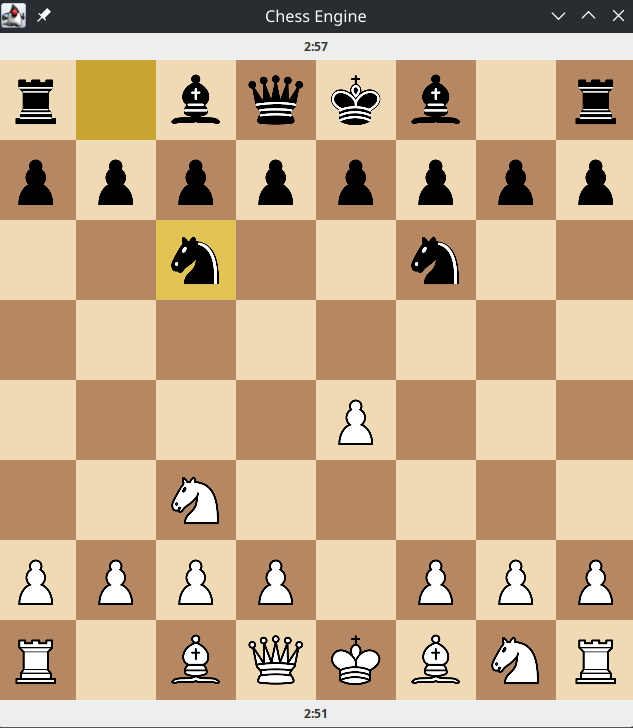

## Screenshot


# Chess Engine with Bitboard Representation

A complete chess engine built in Java from scratch, featuring bitboard representation,
minimax search with alpha-beta pruning, and a Swing-based GUI.

## Features

- **Bitboard Representation**: 12 separate 64-bit bitboards for efficient piece storage
- **Complete Move Generation**: All pieces, special moves (castling, en passant, promotion)
- **Legal Move Validation**: Handles pins, checks, and checkmate detection
- **AI Opponent**: Minimax search with alpha-beta pruning (configurable depth)
- **GUI**: Interactive chess board with piece images and move highlighting
- **FEN Support**: Load any position from FEN notation

## Technical Highlights

- Precomputed attack tables for knights and kings
- Sliding piece move generation with ray-casting
- Position evaluation with material counting
- Make/unmake move system for search

## How to Run

1. Clone the repository
2. Open in your Java IDE
3. Run `gui/ChessApp.java`

## Project Structure
```
src/
├── engine/
│   ├── Evaluator.java
│   ├── GameState.java
│   ├── MoveGenerator.java
│   ├── Move.java
│   ├── Position.java
│   └── Search.java
└── gui/
    ├── BoardPanel.java
    ├── ChessApp.java
    ├── ChessClock.java
    ├── ClockPanel.java
    ├── GameController.java
    ├── GameSetupDialog.java
    │── SoundPlayer.java
    └── resources/
       ├── images
       └── sounds

```
